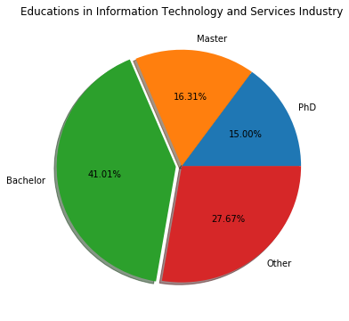

This is the distribution of the education level in the IT industry based on 890194 profiles on LinkedIn. Notice that over 30%
people in this area have graduate level (Master or PhD) degree. Thus we suggest the undergraduate students to pursue a higher
degree if they want to work in this area in the future.

