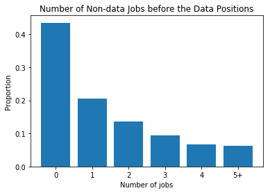

The picture below is the distribution of the number of non-data-related jobs before one works in the data science/analysis
fields. The picture shows that almost half of the employees in the data field take the data-related jobs as their first job,
and the rest half don't. So a student doesn't have to choose a data science/analysis job as her first job if she wants to
work in this area in the future.

